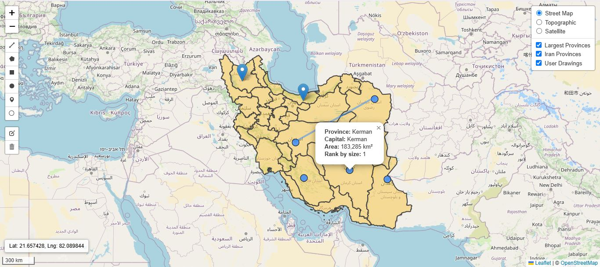

# 🗺️ Iran Provinces Map – Open-Source Web GIS Prototype

A basic but extensible **Web GIS demo application** for beginners and enthusiasts, with full source code and documentation.  
This project visualizes Iran’s provincial boundaries using **GeoServer WMS**, overlaid with major cities as **GeoJSON point data** on an interactive map.

---

## 📺 Demo Video

🎥 Watch the demo on YouTube:  
https://youtu.be/Evt1cmX8OIw?si=TSNGzikFlfzTxBwy

---

## 🖼 Screenshot

<p align="center">
  
</p>

---

## 🚀 Features

- 🗺️ **Interactive map** using [Leaflet.js](https://leafletjs.com/)
- 🌐 Visualizes Iran's provinces via **WMS layer from GeoServer**
- 🏙️ Overlays **major cities** as **GeoJSON** point features
- 🗂️ Multiple base maps: OpenStreetMap, topographic, satellite
- 🛠️ Layer switching, interactive drawing, and feature editing
- 🧭 Intuitive spatial interface with essential cartographic tools

---

## ⚙️ Setup Instructions

### 🔧 Prerequisites

- Python 3.8+
- PostgreSQL + PostGIS

---

### 🛠 Installation

```bash
# 1. Clone the repository
git clone https://github.com/your-username/iran-provinces-webgis.git
cd iran-provinces-webgis

# 2. Create and activate a virtual environment
python -m venv venv
source venv/bin/activate      # On Linux/Mac
venv\Scripts\activate       # On Windows

# 3. Install dependencies
pip install -r requirements.txt

# 4. Run migrations
python manage.py migrate

# 5. Start the server
python manage.py runserver

Visit http://localhost:8000 in your browser.
```

---

## 🌐 GeoServer – WMS Layer Integration (Optional)

Install and run GeoServer locally.

Download the shapefile:  
`data/shapefiles/iran_provinces/iran_provinces.zip`

Extract the archive.

In GeoServer:

1. Create a new Workspace (e.g., `iran_provinces`)
2. Add a new Store: Directory of spatial files (shapefiles)
3. Select the extracted directory
4. Publish the layer using EPSG:4326

JavaScript Integration (Leaflet):

```javascript
const iranProvincesLayer = L.tileLayer.wms("http://localhost:8080/geoserver/iran_provinces/wms", {
  layers: "iran_provinces:province",
  format: "image/png",
  transparent: true
})
```

You can find the JavaScript code for the WMS layer integration in `static/js/map.js`.

---

## 📦 Tech Stack

🐍 Python + Django  
🗺 Leaflet.js  
📡 GeoServer (WMS)  
📁 Shapefiles, GeoJSON  
🌐 HTML/CSS/JavaScript

---

## 🧑‍💻 Use Cases

- Demonstration of WMS integration with web maps  
- Basic Web GIS development training  
- Educational or prototyping use for GIS students and developers

---

## 📄 License

MIT License – Free for academic, commercial, and personal use.

---

## 🙋‍♂️ Author

**Keyhan Khosravifard**  
🌐 [Portfolio Website](https://keyhangis.github.io/)  
🔗 [LinkedIn Profile](https://www.linkedin.com/in/keyhangis)  
📫 [Email](mailto:keyhan.khosravifard@gmail.com)